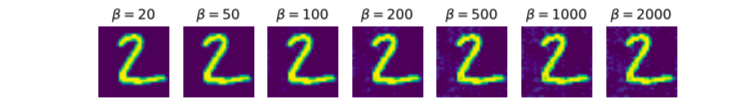

# Generative Teaching Networks Robustness Performance Tests

This repository is a fork of [Generative Teaching Networks](https://arxiv.org/abs/1912.07768) by Uber Labs.
All credit for the implementation of GTNs goes to them.
This repository contains additional code for running some robustness performance tests.
This research was done by Kurt Willis. 
The results were presented in a research seminar about Discrete Optimization and Machine Learning
lead by prof. Sebastian Pokutta at the Technical University of Berlin in July 2021.

The final report can be found in `seminar/report.pdf` and 
the presentation can be found in `seminar/presentation.pdf`.
The rest of this readme contains a simplified markdown conversion of the report.

Some general notes: 
Training custom architectures with a
trained GTN did not work out of the box. The possible architecture
choices are limited. For example, weight normalization is required and
batch normalization does not work. The authors make note of this,
however, the presented architectures in the paper's code containing
pooling layers also don’t seem to work. This means the tests
are restricted to a small set of selected architectures. The authors
seem to train the GTN on one fixed architecture only. The rate of
success of transferring a trained GTN to another architecture is
limited.

Generative Teaching Networks
============

*Meta-learning* is concerned about “learning to learn”. In machine
learning there are generally 3 components that come into play. The
**environment**, the learner **model** and the learning **algorithm**.
In traditional machine learning, the environment and the algorithm are
seen as fixed. Only the model weights are adapted via the learning
algorithm after receiving a signal from the environment (through the
training data). Generative Teaching Networks (GTNs)
[@such2019generative] aim to learn the environment and parameters of the
learning algorithm to accelerate the learning process for a variety of
different kinds of models. The environment and algorithm parameters are
learned via meta-learning by maximizing the performance of models
trained via GTNs on the training data.

A *Generative Teaching Network* is a generative model that is able to
generate images from a latent vector z coming
from some latent distribution. One outer-loop cycle (meta training step)
consists of a full network training cycle (64[^1] inner-loop update
steps).

Robustness Performance Tests
============================

The following performance tests only focus on the MNIST dataset, as the
CIFAR10 dataset results were deemed too unreliable to make any
significant claims. For all experiments, two different GTN models have
been trained that were optimized for the `’base_larger’` and
`’base_larger3’` models respectively. These two GTN choices each trained
a total of 9 different architecture *learner types*. Furthermore, three
different learning algorithms are considered, `’10_gtn’`, `’gtn’` and
`’vanilla’`. Models trained with `’10_gtn’` received 10 (inner loop)
update steps from the GTN, `’gtn’` the full 64 steps. Models trained
with `’vanilla’` are trained with a classical learning algorithm (Adam
optimizer, 1 epoch over training data). In order to have a fair
comparison, the criteria for accepting models of a certain learner type
is that the minimum value over the learning algorithms (`’10_gtn’`,
`’gtn’`, `’vanilla’`) has a mean accuracy greater than 0.7 for 5
individually trained models. This limited the choice of available
learner types to only two (`’base_larger’` and `’base\_larger3’`) of 9.

The robustness tests include input corruption by augmentation (adding
noise and blurring) and the FGSM and LBFGS adversarial attacks. All
tests are performed on unseen test data of size 10,000 and 1,000 for the
augmentation and adversarial attacks respectively. In all tests, the
input image is clipped to its valid range.

Noise Corruption
----------------

In this setting, Gaussian noise that is sampled from a normal
distribution with standard deviation of $\beta$ is added to the input.

Blurring
--------

For this test, a blur filter is applied to the input via convolution
with a Gaussian kernel with standard deviation of $\beta$.

FGSM-Attack
-----------

The Fast-Gradient-Sign-Method is performed by calculating the gradient
of the loss with respect to the input. The input is then moved by
$\beta$ in the direction (sign) of increasing loss. This is done for
$30$ steps.

LBFGS
-----

The Box-constrained LBFGS-attack is performed similarly to the
FGSM-attack by calculating the gradient of the loss with respect to the
input. The loss here, however, is the cross-entropy loss minus the $l2$
distance of the current input to the original input multiplied by
$\frac 1 \beta$ (this ensures that the computed adversarial output stays
close to the original sample). The input is then moved by the update
rate $\varepsilon=0.002$ times the gradient of the loss. This is also
done for $30$ steps.

Conclusion
==========

The general narrative has been that training a network to higher
accuracies leads to decreasing generalization [@zhang2019theoretically].
This is verified by comparing the networks trained with GTNs for the
full 64 steps with those trained for only 10 steps. However, networks
trained with a vanilla learning algorithm seem to, for the most part,
outperform those trained by GTNs while still showing increased
robustness towards input corruption and adversarial attacks. This leads
to the conclusion that networks trained with GTNs are indeed less robust
compared to those trained in a traditional way. However, since these
experiments are only run on one dataset and GTNs will likely improve
over time, more data is required to make any substantial claims.

[^1]: The workings of GTNs will be illustrated by presenting the
    specific hyperparameter values used in the experiments, although
    most of these can be set arbitrarily.
